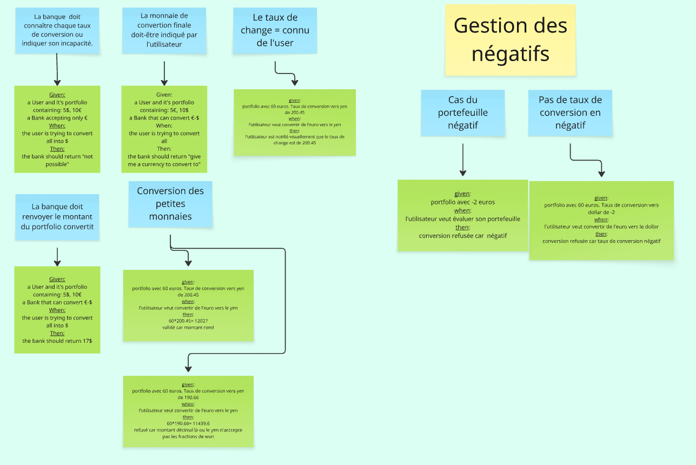

# Example Mapping

## Format de restitution
*(rappel, pour chaque US)*

```markdown
## Titre de l'US (post-it jaunes)

> Question (post-it rouge)

### Règle Métier (post-it bleu)

Exemple: (post-it vert)

- [ ] 5 USD + 10 EUR = 17 USD
```

Vous pouvez également joindre une photo du résultat obtenu en utilisant les post-its.

## Évaluation d'un portefeuille


# Portfolio – Règles complémentaires & gestion des cas limites

## Feature: Contraintes de conversion et cas particuliers

---

## Scenario: Conversion impossible sans taux de change

```gherkin
Given un utilisateur avec un portfolio de 5 USD
And la banque ne possède aucun taux de conversion
When l'utilisateur tente de convertir en EUR
Then une erreur est retournée indiquant que la conversion est impossible
```

---

## Scenario: Devise cible non fournie

```gherkin
Given un utilisateur avec un portfolio de 5 USD
When l'utilisateur tente une conversion sans préciser la devise cible
Then une erreur est retournée indiquant qu'une devise cible est requise
```

---

## Scenario: Affichage du taux de change utilisé

```gherkin
Given un portfolio de 10 EUR
And un taux de conversion EUR -> YEN de 200.45
When l'utilisateur convertit en YEN
Then l'utilisateur reçoit le montant converti
And le taux de change utilisé (200.45) est affiché
```

---

## Scenario: La banque retourne le montant total converti

```gherkin
Given un utilisateur avec un portfolio de 5 USD
And un taux de conversion USD -> EUR de 3.5
When l'utilisateur convertit en EUR
Then la banque retourne 17.5 EUR
```

---

## Scenario: Conversion de petites monnaies (arrondi)

```gherkin
Given un portfolio de 0.5 EUR
And un taux de conversion EUR -> YEN de 200.45
When l'utilisateur convertit en YEN
Then le montant est correctement calculé
And le résultat est arrondi selon les règles définies
```

---

## Scenario: Refus des fractions non supportées

```gherkin
Given un portfolio de 5 EUR
And un taux de conversion EUR -> YEN de 199.66
When l'utilisateur convertit en YEN
Then la conversion est refusée si la devise cible n'accepte pas les fractions
```

---

## Feature: Gestion des négatifs

---

## Scenario: Refus d’un portefeuille négatif

```gherkin
Given un portfolio de -2 EUR
When l'utilisateur tente de convertir ce portefeuille
Then la conversion est refusée car le montant est négatif
```

---

## Scenario: Refus d’un taux de conversion négatif

```gherkin
Given un portfolio de 5 EUR
And un taux de conversion EUR -> USD de -2
When l'utilisateur convertit en USD
Then la conversion est refusée car le taux de conversion est négatif
```

---

## Règles de gestion

- La banque doit connaître les taux de conversion ou indiquer son incapacité  
- La devise cible doit obligatoirement être fournie  
- Le taux de change utilisé doit être communiqué à l’utilisateur  
- La banque doit retourner le montant total converti  
- Les petites valeurs doivent être correctement gérées (précision / arrondi)  
- Certaines devises peuvent refuser les fractions  
- Un portefeuille négatif est invalide  
- Un taux de conversion négatif est invalide